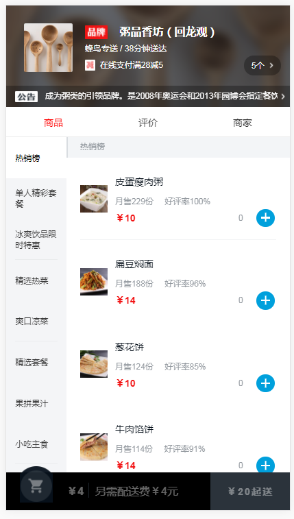
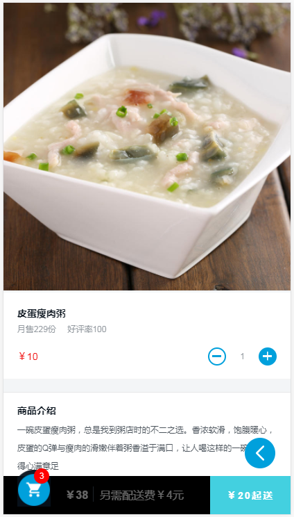
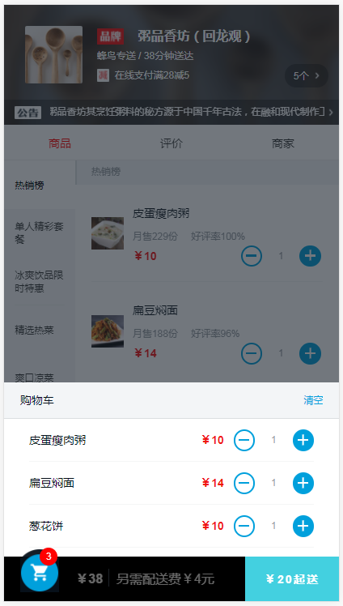
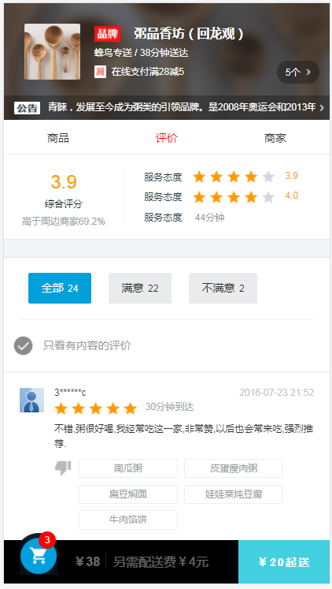
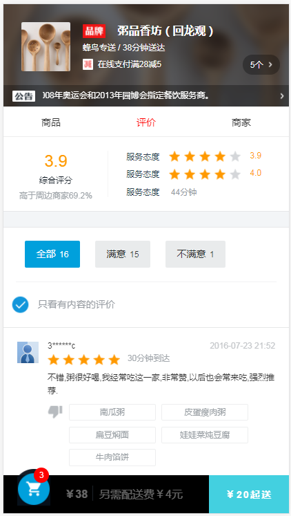

# 描述
    用vue开发的模仿饿了吗移动端单个餐厅页面（vue上手项目）

# 技术栈
vue2 + vuex + vue-router + webpack + es6 + axios + flex布局 + sass

# 演示
[查看演示效果](https://erpang123.github.io/vue2.0-dom/dist-html)（请用chrome的手机模式预览）

## 项目运行

``` bash
# install dependencies
npm install

# serve with hot reload at localhost:8080
npm run dev

# build for production with minification
npm run build

# build for production and view the bundle analyzer report
npm run build --report
```

For detailed explanation on how things work, checkout the [guide](http://vuejs-templates.github.io/webpack/) and [docs for vue-loader](http://vuejs.github.io/vue-loader).

# 部分截图
## 商品列表

## 商品详情

## 购物车列表

## 评价



# 项目布局
```
.
├── build                                       // webpack配置文件
├── config                                      // 项目打包路径
├── data                                        // 打包后各文件的所占比重图
├── dist                                        // 上线项目文件，放在服务器即可正常访问
├── mock                                        // 模拟数据
├── screenshots                                 // 项目截图
├── src                                         // 源码目录
│   ├── components                              // 组件目录
│   │   ├── detail-info.vue                     // 商品详情
│   │   ├── detail-raing.vue                    // 详情中的评价列表
│   │   ├── foot.vue                            // 公共底部
│   │   ├── goods.vue                           // 商家模块
│   │   ├── head.vue                            // 公共头部
│   │   ├── main.vue                            // 商品，评价，商家的父组件
│   │   ├── message.vue                         // 评价模块
│   │   ├── messageInfo.vue                     // 评价列表
│   │   ├── Seller.vue                          // 商品列表
│   │   ├── SellerList.vue                      // 增加和减少商品的组件
│   │   ├── shop-cart.vue                       // 购物车列表
│   │   ├── shop-info.vue                       // 商家详情
│   │   └── star.vue                            // 星级组件
│   ├── assets                                  // 公共图片
│   ├── router
│   │   └── index.js                            // 路由配置
│   ├── store                                   // vuex的状态管理
│   │   ├── action.js                           // 配置actions
│   │   ├── getter.js                          // 配置getters
│   │   ├── index.js                            // 引用vuex，创建store
│   │   ├── state.js                            // 定义常量
│   │   └── mutations.js                        // 配置mutations
│   └── sass
│       └── main.min.css                        // 样式文件
│   ├── App.vue                                 // 页面入口文件
│   ├── main.js                                 // 程序入口文件，加载各种公共组件
├── index.html                                  // 入口html文件
.
```